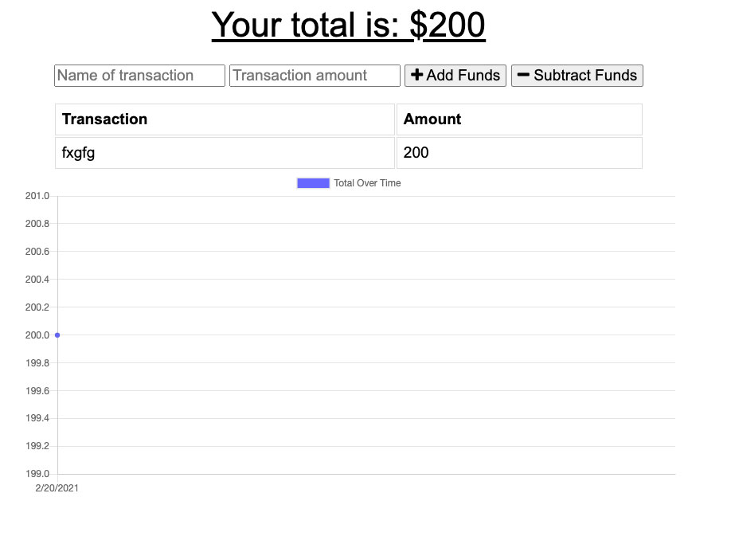

# Budget-Tracker

## Description 
Budget App that keeps saved data in the apps Database without an internet connection. 

## Table of contents
- [Description](#Description)
- [Installation](#Installation)
- [Usage](#Usage)
- [Repository Link](#Repository)
- [GitHub Info](#GitHub) 

## Screenshots

## Installation
        Runs in Web Browser
## Usage
- [Budget-Tracker](https://bartcusick.github.io/Weather-Dashboard/)
## Repository
- [Budget-Tracker Repo](https://github.com/bartcusick/Budget-Tracker)
## GitHub
- Email: bartcusick@gmail.com
- [GitHub Profile](https://github.com/bartcusick)
